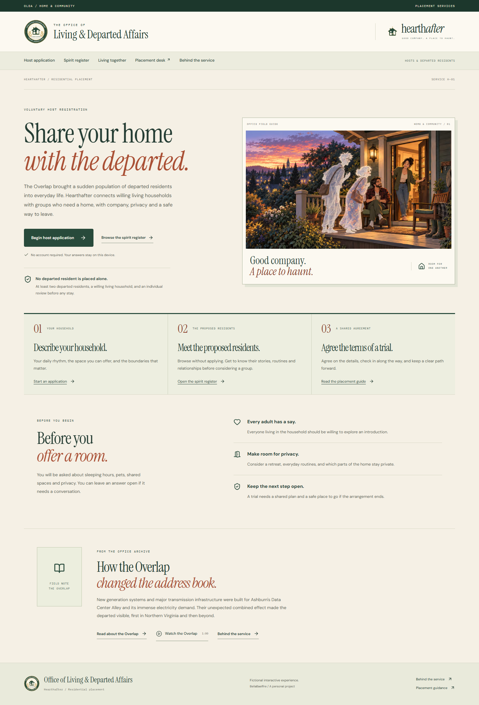

# HEARTHAFTER

**Good company. A place to haunt.**

Hearthafter is a speculative-fiction experience about finding a home for departed residents together. After the Overlap makes the departed visible, the fictional Office of Living & Departed Affairs requires a placement review. No departed resident is placed alone. Households volunteer, every resident can refuse, and a promising introduction still needs a trial plan, the required individual decisions, and a confirmed place to go if the stay ends.

The application combines nine fictional spirit dossiers, five synthetic households, transparent group matching, and a browser-local placement journey. The six original adults are joined by the Aster family: Mara, Leon and nine-year-old Kit. The shared engine supports groups of two to twelve; the public browser offers pairs and groups of three. It is built with Next.js, React, TypeScript, Sanity Content Lake, a custom App SDK desk, and a native Sanity Workflows integration.

This is BellaBaelfire's personal project. Every spirit, household, case, quotation, and historical excerpt belongs to the story. The application does not offer paranormal contact or a real housing service.

## Choose your visit

| Quick demo | Deep dive |
| --- | --- |
| [Watch the short walkthrough](https://hearthafter.homes/about#quick-demo) | [Follow the interactive route](https://hearthafter.homes/about#deep-dive) |
| See a firm camera boundary, a separate quiet-hours agreement, the verified source-change example and a family review. | Explore the actual linked registry and reproduce the matching and consent decisions in your browser. |

No login is needed for either public route. Published source records come from Sanity; visitor answers and cases stay in the browser. The video shows the public interface and describes an earlier verified authenticated test. It does not show a live staff edit.

[Written walkthrough and screenshots](docs/deep-dive.md)

## Current delivery status

[Open the live application](https://hearthafter.homes). The guest journey requires no login. The staff placement desk uses Sanity sign-in and project administrator permissions.

The final candidate contains **nine spirits, five homes and 56 source documents**, plus one artwork singleton, for **57 application content documents**. The three native image-asset documents are counted separately. The full fixture manifest is [docs/seed-manifest.json](docs/seed-manifest.json); the nineteen additive family and household records are listed in [docs/additional-fixtures-manifest.json](docs/additional-fixtures-manifest.json). The six original profiles and portrait atlas are preserved. Kit has an original code-authored child illustration.

The checked-in Worker maps both `hearthafter.homes` and `www.hearthafter.homes`. Read requests to the www alias redirect to the canonical HTTPS apex while preserving their path and query. Workers.dev and version-preview routing are disabled. Final unit, browser, build and hosted-readback results belong to the release verification report; earlier run totals are not a substitute for checking this candidate. The reviewed source is public at [bellabaelfire/hearthafter](https://github.com/bellabaelfire/hearthafter).

## Preview



[Watch the walkthrough](https://hearthafter.homes/about#quick-demo) | [See the family decisions](docs/demo/family-consents.png) | [Explore the linked registry](https://hearthafter.homes/about#behind-the-service)

The gallery contains recorded examples of the public experience. Use the live application to inspect the current register, matching explanations and in-app introduction.

## Try the central example

1. Open **Begin host application** and choose June and Leila's example household.
2. Review Iona Vale and Orin Pell together. Iona prefers an early start; Orin prefers a late finish. Both overlap the home's 22:00 to 07:00 quiet window.
3. Read and accept the offered quiet arrangement. The individual preference scores recalculate. Orin's offered arrangement ends his light by 22:00; silence does not imply permission for later light.
4. Compare the same pair with Noor's household. Noor keeps an indoor pet camera active. Orin requires a camera-free presence area, so the pair is excluded before any score is calculated.
5. Return to June and Leila and open a review. Save an editable trial and relocation plan, answer the outstanding introduction questions, and record the three consent records. Individual adult and regional-relocation confirmations are separate required questions.
6. Choose **Begin trial stay**, then **Record trial outcome** when exploring the next step. Record a substantive outcome, or withdraw a party's consent and complete the relocation handover.
7. Open **View case record** for a printable summary of the household, two profiles, plan, and three recorded decisions. A stale record clearly requires review; a failed registry check disables printing.

The scores express illustrative preferences, not a measured success rate. No trial begins just because a number is high. This guest journey is a fictional browser-local demonstration; advancing it does not verify that seven or fourteen real days elapsed. The public interface keeps service language in the main flow, with one footer fiction notice and optional details at `/about` and inside a case's **Demo details**.

The original June and Leila, North Window, and Noor presets each offer two departed places. Robin and Esme's single-parent home and the Lantern House student share each offer three. Choose Lantern House to consider Iona, Orin and Tavi together after their quiet-hours agreement. A larger group cannot silently expand a household's offered capacity.

The Aster family can be considered together in either new home. Each profile requires the other two as companions. Kit remains with Mara, their documented departed guardian, and needs age-appropriate assent separately from Mara's care agreement. Opening this family review creates five pending decisions: the household, both adult residents, the guardian care agreement and Kit's assent. Required care, child-comfort, household and safe-exit conversations still need affirmative answers before a trial.

**Watch the Overlap** opens a 60-second HTML film with five animated scenes, each lasting twelve seconds. HTML, CSS, SVG and the supplied artwork tell the fictional story from Northern Virginia’s power infrastructure through the Overlap and the Office’s voluntary placement programme. Pause, replay, skip and keyboard dismissal are supported. Reduced-motion mode provides manually navigated scenes. Finishing does not navigate automatically; the final scene offers **Begin host application**. The optional registry explorer on `/about` shows actual content references and the verified change-impact example.

## Requirements

The verified local environment uses Node.js **24.19.0** and pnpm **11.25.0**. Install Node 24 and pnpm 11 before following the commands below. The checked-in lockfile is the dependency authority.

Key installed versions verified during this documentation pass:

| Package | Version |
| --- | --- |
| Next.js | 16.3.8 |
| React / React DOM | 19.3.0 |
| Sanity Studio | 6.17.0 |
| `next-sanity` | 13.3.4 |
| `@sanity/client` | 8.7.0 |
| `@sanity/sdk-react` | 3.7.0 |
| `@sanity/workflow-engine` | 0.36.0 |
| TypeScript | 5.9.3 |

Workflows is an early-access dependency. Keep the pinned package versions together when reproducing this build. Review the [official Workflows documentation](https://www.sanity.io/docs/workflows/prerelease) before an upgrade.

## Run the offline preview

The development checkout deliberately stores its caches and temporary files inside the project. `scripts/env.ps1` derives those paths from its own checkout location and can be dot-sourced from any working directory. `pnpm-workspace.yaml` uses relative `.cache` paths, so a clone needs no machine-specific path edit before installation. On a non-Windows machine, supply equivalent project-local environment paths instead of running the PowerShell helper.

From the verified Windows checkout:

```powershell
Set-Location D:\CODEX\hearthafter
. .\scripts\env.ps1
pnpm install --frozen-lockfile
$env:HEARTH_DATA_MODE = 'offline'
pnpm dev --port 3333
```

The helper reuses Node and pnpm already installed on the machine; it does not download tooling. If either command is missing from PATH, dot-source it with `-NodeExecutable` pointing to the installed `node.exe` and `-PnpmEntrypoint` pointing to the installed `pnpm/bin/pnpm.cjs`. It creates an ignored project-local pnpm launcher when needed and adds the tooling paths for that process. The corrected setup was checked with pnpm 11.25.0 and a passing `pnpm typecheck`.

Open `http://localhost:3333`. Offline mode is also the default when `HEARTH_DATA_MODE` is unset. It needs no Sanity credentials, remote writes, or runtime AI key and uses the original local artwork. Mode information is available in the optional technical tour at `/about` and case details.

Visitor household answers, simulated placements, and their local audit timeline are stored under the browser's `hearthafter-household-v1` local-storage key. They are not uploaded to Sanity. Use **Your cases** to reopen a saved review or start a fresh local visit. Clearing browser storage removes that browser's simulations.

If the live registry is unavailable, valid saved cases remain readable with their saved trial plan, decisions, notes and exit arrangements clearly marked as unverified. A participant can record a refusal or withdrawal locally; a review becomes declined, and an active stay moves to relocation. This action contacts nobody and does not arrange a move. New agreements, new cases, starting a trial and confirming a settled stay remain blocked until current sources return. The printable case record also requires a successful registry check.

## Connect Sanity content

Use `.env.example` as a reference for `.env.local`, or set these variables in the process that builds and starts Next.js. The `NEXT_PUBLIC_` project and dataset values must be present before a production build: they configure the browser bundle and the allowed Sanity image paths. Rebuild after changing them.

```dotenv
HEARTH_DATA_MODE=sanity
NEXT_PUBLIC_SANITY_PROJECT_ID=YOUR_PROJECT_ID
NEXT_PUBLIC_SANITY_DATASET=production
HEARTH_STUDIO_ORIGIN=http://localhost:3333
```

The challenge project's identifier is `o3jy1zm6`, dataset `production`. Those identifiers are public configuration, not credentials. They can be used for anonymous public reads. Use a project you administer for staff-write testing; the challenge dataset is not a shared sandbox for arbitrary writes.

Live public reads use the published perspective, bypass Sanity's CDN, and require both seeded content and published artwork. The server coalesces simultaneous guest reads and retains a successful result for at most one second per isolate. Authenticated placement decisions bypass that browsing cache. Public responses use `no-store`, and a failed live read never supplies expired results or local fixtures. Guest pages refresh visible content every fifteen seconds and when focus or visibility returns; they do not claim a live subscription. The short cache reduces duplicate reads but is not a global request or spending cap.

Add the exact browser origin you intend to use to your Sanity project's CORS settings if needed. The current project already has credentialed `http://localhost:3333`. A different port, hostname, or hosted origin needs its own explicit configuration. `HEARTH_STUDIO_ORIGIN` configures application origin checks; it does not change Sanity's CORS settings.

### Seed the fictional source records

The source seed is deliberately safe to preview:

```powershell
pnpm seed:sanity
```

It validates the source records and the three original PNG hashes without making remote writes. The shipped uploader intentionally permits only the approved `o3jy1zm6/production` target and requires `docs/seed-manifest.json` to match the current encoded fixtures exactly. For the authorized owner of that project, authenticate through the Sanity CLI, confirm the configured project and dataset, then run:

```powershell
node .\node_modules\sanity\bin\sanity login
node .\node_modules\sanity\bin\sanity exec scripts/seed-hearth.ts --with-user-token -- --write
```

The seed uploads the three PNGs from `public/art`, creates the artwork singleton with native asset references, and writes the 56 source records. It uses `createIfNotExists`: it creates missing records and preserves existing documents. Rerunning it does not replace an editor’s changes or migrate previously seeded content. The nineteen additive records have a separate reviewable manifest; existing-source updates require a targeted revision-guarded migration. The seed never creates or prints an authentication token. The [Sanity exec reference](https://www.sanity.io/docs/cli-reference/exec) explains how the existing CLI session is supplied to the script.

Fork authors must deliberately review and change the target-project guard in `scripts/seed-hearth.ts` before writing to a different project. If the fictional fixtures change, regenerate and inspect `docs/seed-manifest.json` from `encodeState(createInitialHearthState())`; the expected file format is two-space JSON followed by a newline. The script does not create a project, dataset, CORS grant, or token. The approved public copies under `public/art` are sufficient; the private creative-input pack is not required.

### Use the staff desk

Open `/desk` and sign in with a Sanity project-member account. The custom placement tool uses the App SDK inside Studio. The records tool exposes the structured content and reference relationships.

The application permits placement mutations only for a verified project administrator. Other authenticated project members are read-only in the placement API. Public visitors need no account and cannot write staff records. Do not publish administrator credentials for judges; the public simulation is the guest test path. A restricted staff demonstration can be shown in a reviewed recording or arranged separately.

The staff API accepts only the predefined synthetic households. It rejects visitor-created household answers even if an authenticated caller submits them. Every placement write is validated again on the server.

### Native readiness review

The native definition is `placement-readiness`, tag `production`. It submits a specific placement revision for human review, allows approval or requested changes, and records the decision next to the placement in Sanity.

Validate the definition without deploying it:

```powershell
pnpm exec tsx scripts/deploy-workflow.ts
```

After separately deciding to deploy it to your project:

```powershell
node .\node_modules\sanity\bin\sanity exec scripts/deploy-workflow.ts --with-user-token -- --deploy
```

The private definition `production.placement-readiness.v1` is deployed. A real authenticated API exercise verified approval against the exact placement revision, recorded that approval on the trial audit, and completed review, trial, settled, relocation, and closure. Missing native approval was rejected with HTTP 409. An exact approval replay caused no change. Guest browser cases use the same domain rules but do not create native workflow instances.

The live exercise also verified concurrent updates yielding one HTTP 200 and one HTTP 409, repeated commands without extra audit events, changed-intent rejection, anonymous-write rejection, and untrusted-origin rejection. Anonymous reads exposed none of the private definitions, instances, placements, or audits. This is API and engine evidence. Separately, a signed-in administrator exercised the App SDK pairing controls and a published readback confirmed the change. The test status was restored with a revision guard. The SDK save UI waits for network submission before reporting success.

Native workflow filters and guards are advisory in the early-access product. The placement API independently enforces authentication, consent, source freshness, plans, and state transitions. A privileged administrator can still edit the dataset directly. See [Sanity's enforcement guidance](https://www.sanity.io/docs/workflows/actors-and-enforcement).

### Inspect a published rule change

The [controlled change-impact guide](docs/change-impact-drill.md) documents the real draft-to-publication test and its restoration checks. The script defaults to a preview without remote mutations:

```powershell
node .\node_modules\sanity\bin\sanity exec scripts/verify-change-impact.ts --with-user-token
```

Only an authorized administrator coordinating with other editors should add `-- --run`. That mode temporarily changes the demonstration household, creates a private test case, verifies its effects, and restores the original source content. It refuses to overwrite an existing draft or a changed source revision. The source revision still advances after restoration, so old consent does not silently become valid again. The public About page explains the completed result without exposing these administrative controls.

## Checks

Run the normal project checks from the configured checkout. The build creates Next.js route types before standalone typechecking on a fresh checkout:

```powershell
pnpm test
pnpm build
pnpm typecheck
pnpm test:e2e
```

The unit suite covers hard exclusions before scores, explicit unknowns, half-hour quiet windows, real recalculation after negotiation, lost company windows, correctly scoped questions, stale source revisions, idempotency, refusal, plan changes, answer retention, trial and relocation requirements, native-reference transport, correction notices and case-record states. Group checks cover every resident and every relationship threshold, offered capacity, required companions, guardian care and child assent. Recovery checks cover saved-record validation and local withdrawal while the registry is unavailable. Security checks cover bounded request bodies and saved data, strict command fields, image restrictions, short-lived public caching, canonical-host redirects and safe error responses.

The Playwright suite starts or reuses `http://localhost:3333`. It uses Microsoft Edge when installed at the configured Windows path, otherwise the normal Playwright browser. If a Playwright browser is needed, install it into the configured project-local `PLAYWRIGHT_BROWSERS_PATH` first:

```powershell
pnpm exec playwright install chromium
```

For controlled offline browser checks, start the server with `HEARTH_DATA_MODE=offline`. A server already running in live mode will be reused outside CI, so verify its mode before interpreting results. `HEARTH_TEST_URL` can point the tests at another server. The browser suite covers central comparison, pairs and three-resident groups, family requirements, local trial and withdrawal, refusal, persistence, retry states, mobile navigation, case-record freshness and printing, introduction controls, immediate focus and visibility refresh, cross-tab state, malformed saved-case recovery and inert display of saved markup. Introduction checks cover timing, pause, 60-second completion without navigation, repeat launches, focus restoration, reachable small-screen controls and manually advanced reduced-motion scenes. Record final results from the candidate being released.

Separate anonymous HTTP checks against that local production server confirmed the configured security headers, rejection of five disallowed image requests, a successful permitted image transformation, rejection of unsigned staff requests and foreign-origin writes, and empty private-record arrays in the public registry response. Seven selected private-file paths returned 404. These bounded checks do not establish comprehensive security or accessibility certification, signed-in App SDK behavior, or a hosted deployment.

## Project map

| Path | Responsibility |
| --- | --- |
| `src/lib/hearth/domain.ts` | Shared data and command types |
| `src/lib/hearth/fixtures.ts`, `additional-fixtures.ts` | Original fictional source records and additive family and household examples |
| `src/lib/hearth/matching.ts` | Deterministic group evaluation, individual relationship checks and source snapshots |
| `src/lib/hearth/placement.ts` | Pure placement state machine and audit events |
| `src/lib/hearth/source-corrections.ts`, `case-record.ts`, `saved-case-recovery.ts` | Changed-term notices, printable summaries and local refusal during registry outages |
| `src/lib/hearth/sanity/` | Content queries, codecs, authentication, repository, and native review |
| `src/sanity/` | Studio schema, record structure, and custom App SDK desk |
| `src/components/` | Public profiles, quiz, matching, local simulation, and story interface |
| `src/app/api/` | Public content, session verification, and staff placement commands |
| `scripts/` | Environment controls, source seeding, workflow deployment, and the controlled change-impact drill |
| `tests/` | Domain, transport, and browser checks |
| `public/art/` | The three approved original PNG assets |

See [the architecture summary](docs/architecture.md) for data flow and known limitations. No license or third-party rights grant is implied by this draft; the repository's final licensing choice remains an owner decision.

## Cloudflare Workers build

The checked-in adapter targets one `hearthafter` Worker with explicit custom-domain mappings for `hearthafter.homes` and `www.hearthafter.homes`. The apex is canonical. GET and HEAD requests to www receive an HTTP 308 redirect to the HTTPS apex with the path and query preserved; write requests retain the established origin checks instead of being redirected. API ingress protections run before redirects. Workers.dev and version-preview routing are disabled. Review the account and both hostnames before deploying a fork. Hosting does not submit a contest entry.

Set the Sanity project, dataset and live mode variables before the build, as above. Then run:

```powershell
pnpm build:cloudflare
pnpm preview:cloudflare
```

The build command invokes the pinned OpenNext adapter. On Windows it replaces only generated directory links with junctions to their corresponding traced package copies. It does not change OS developer settings or edit installed package code. Linux and macOS use the same command without the Windows link adjustment. Generated `.open-next` and local `.wrangler` state are ignored.

The local Worker preview opens at `http://127.0.0.1:8788`. This is a runtime compatibility preview; signed-in Studio access requires an approved exact Sanity CORS origin. The current credentialed local Studio origin is `http://localhost:3333`.

Before a deployment, inspect the upload without changing Cloudflare:

```powershell
pnpm exec wrangler deploy --dry-run
```

The configuration uses Workers static assets and direct Sanity CDN artwork transformations. It adds no R2, KV, D1, Durable Object or Cloudflare Images resource. The supported no-persistent-cache defaults avoid a mismatch between Next 16.3 route cache keys and exported static cache files. Public registry requests still use the application's one-second cache and live published reads.

Native ingress bindings give registry and staff routes separate allowances of 60 requests per minute per client IP. Their keys include the application and route group. These location-local, eventually consistent limits are abuse controls, not exact accounting or a monthly spending ceiling. The Worker guard caps the body stream delivered to Next at 64 KiB and ten seconds, including OPTIONS and unknown routes. Local runtime probes verified both bounds; the external client upload deadline was not established by the hosted slow-body probe. The unused Next image proxy is rejected. A 1000 ms CPU limit applies per request. Existing paid-account allowances are shared; usage above those allowances can incur overage.

Only after reviewing the exact account and public content, authenticate through Wrangler and run `pnpm deploy:cloudflare`. Do not register or change an account suffix, DNS record or custom route as an incidental setup step. A hosted Studio origin requires a separate exact credentialed CORS grant; guest public reads do not require it. No server administrator token is configured or needed.
