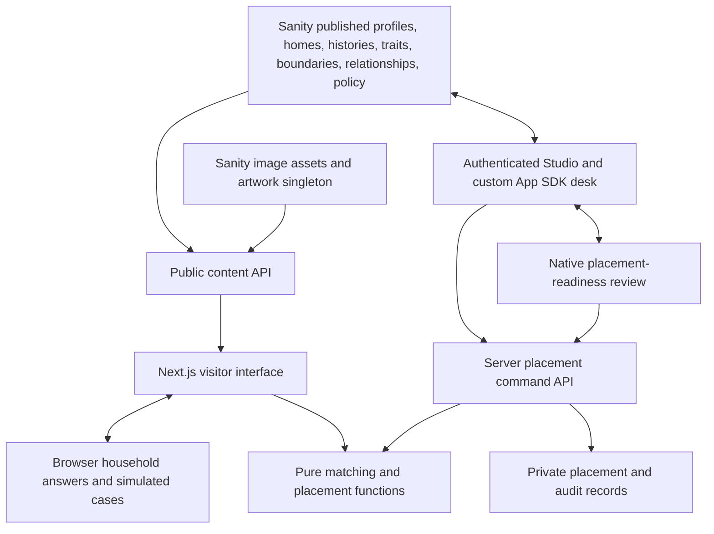
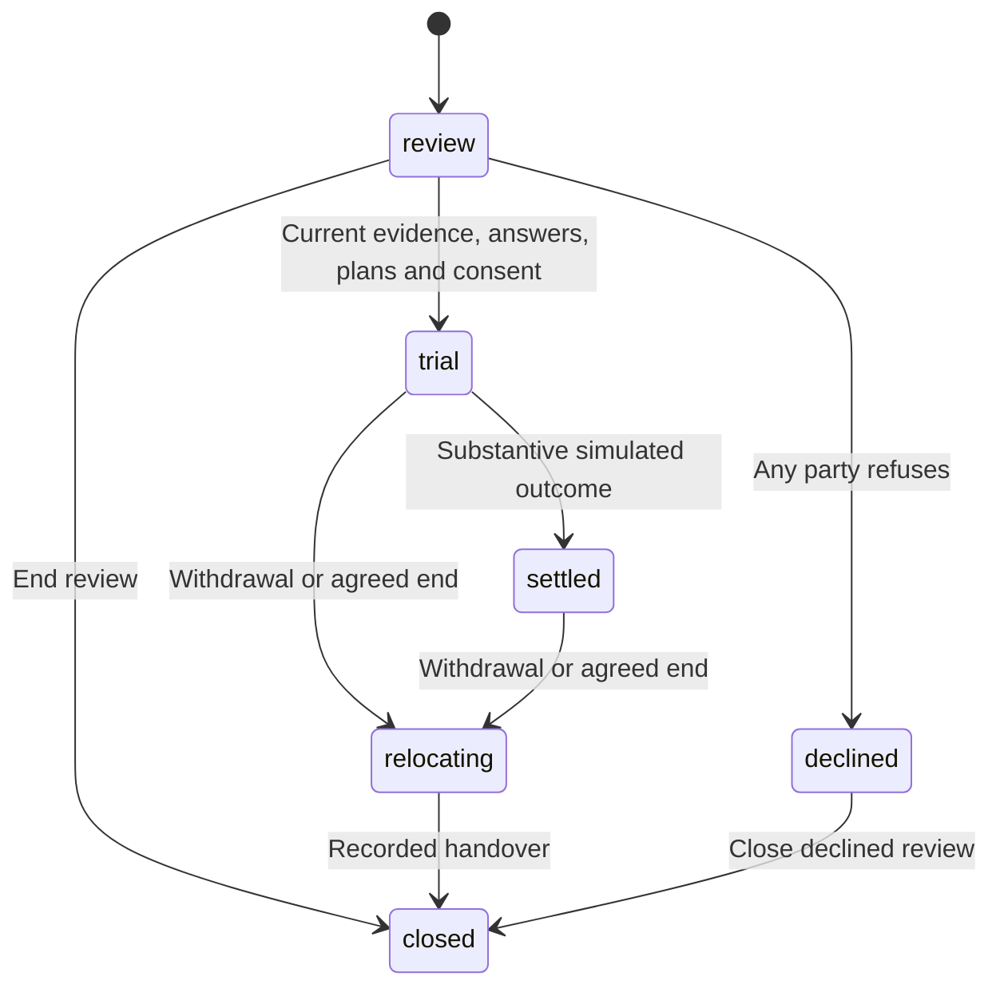

# Hearthafter architecture

Hearthafter keeps story, matching evidence, and placement decisions separate. Sanity holds the published fictional registry and authenticated staff records. Pure TypeScript evaluates groups of two to twelve departed residents and their placement commands; the public browser offers groups of two or three. The visitor experience uses that same domain code for a browser-local demonstration.

The public presentation puts the Office of Living & Departed Affairs first, with Hearthafter as its residential-placement service. The main flow uses customer language such as **Begin host application**, **Begin trial stay**, and **Record trial outcome**. A single footer notice identifies the experience as fiction. Privacy, local storage, trial-time behavior, and an optional technical tour live at `/about`, with additional case details available on demand.

## Data flow

Public content loads with an unauthenticated Sanity client, the published perspective, and no CDN cache. The query explicitly projects empty placement and event arrays. The visitor provider overlays only its own browser-local cases and refreshes published source content every fifteen seconds while the page is visible. A live-read failure produces a visible error and a saved-case recovery view where applicable. It never supplies local fixtures as replacement live source records.

The public reader coalesces simultaneous reads and retains a successful result for at most one second per server isolate. Its single cache entry is keyed only by configured Sanity project, dataset and API version, and expired data is never served after a failed read. Public responses still use `no-store`. This can add up to one second of server-side browsing delay; authenticated placement decisions bypass this cache and reread current sources. This reduces repeated origin work but does not impose a global request or spending cap.

The staff desk uses `SanityApp`, `useQuery`, `useDocument`, and `useEditDocument`. Its pairing-rule control edits a published relationship directly through the App SDK. Placement decisions travel through the server API instead of being arbitrary client patches.

## Structured source model

| Sanity document type | Seed count | Purpose |
| --- | ---: | --- |
| `hearthSpirit` | 9 | Eight adults and one dependent child, biographies, routines, source links, boundaries, companion requirements and introduction questions |
| `hearthHome` | 5 | Synthetic household story, anonymous preferences, offered departed capacity, practical terms and household confirmations |
| `hearthHistory` | 9 | Explicitly labeled in-world record excerpts, dates, disputed attribution, and editorial context |
| `hearthTrait` | 9 | Reusable traits and their complementary relationships |
| `hearthBoundary` | 17 | Structured hard conditions and supported negotiation rules |
| `hearthPairRelationship` | 6 | Proposed compatibility, shared evidence, and any pairing prohibition |
| `hearthMatchingPolicy` | 1 | Named weights and thresholds |
| `hearthArtwork` | 1 | Native references to the three approved Sanity image assets |

The first seven categories are the **56 source documents**. With the artwork singleton, the candidate contains **57 application content documents**. The three native `sanity.imageAsset` documents are counted separately. The full encoded fixture set is `docs/seed-manifest.json`; `docs/additional-fixtures-manifest.json` contains only the nineteen new family and household records. The six original adult profiles and their atlas cells are preserved, while Kit uses an original code-authored child illustration.

Domain IDs remain stable between local and live content. The Sanity encoder creates native reference fields for profiles, histories, traits, boundaries, pair members, required companions, guardians, homes and placements so editors can traverse the records in Studio. The decoder maps the actual Sanity `_rev` to the domain’s string `rev` and removes transport metadata.

The uploaded content includes no visitor applications or actual historical claims. A spirit's willingness to be considered is a profile fact; it is not consent to any particular residential stay.

## Matching sequence

`evaluatePair(state, {home, spiritIds, acceptedClauseIds})` retains its legacy function name but evaluates two to twelve distinct departed residents. `rankPairs` evaluates the 36 possible pairs in the nine-person register; `rankGroups` also offers the 84 possible three-resident combinations. Ranking includes excluded and incomplete results so the interface can explain why a candidate does not qualify.

1. Validate the anonymous home value, selected group, source references and matching policy.
2. Check household and resident willingness, offered capacity, required companions, the documented adult guardian for each child, hard boundaries, pet exclusions and missing required facts.
3. Check recorded company windows against quiet hours. A preferred window that is entirely consumed by quiet time needs another conversation. Agreeing to silence cannot invent an afternoon routine.
4. Identify the supported quiet-hours agreement. It changes an adjustable routine, including sound, light, and agreed manifestations, without overriding a camera boundary, a refusal, or another essential need.
5. If exclusions or unresolved matching facts remain, return explicit reasons and null scores.
6. Otherwise score each resident against the home and every pair of residents against one another. Each resident must reach 45 and every relationship must reach 50; the overall score must reach 60. The relationship mean and overall mean cannot conceal a failing resident or relationship.
7. Keep introduction questions outside the preference score. Pet comfort, recording terms, actual retreat availability, each adult’s approval, guardian care, age-appropriate child assent, household continuity, destination confirmation and regional choice can remain unanswered even when an introduction looks promising.

The matching policy uses home weights of energy 30, amount of company 25, shared interests 25, and quiet compatibility 20. Pair weights are complementary traits 40, shared interests 25, presence patterns 20, and relationship evidence 15. These are transparent illustrative editorial weights, not trained probabilities or measured placement success rates.

The original June and Leila, North Window and Noor presets explicitly offer two departed places. The new Robin and Esme home and Lantern House student share each offer three. A numeric capacity below the selected group size excludes the group. An explicitly unknown capacity blocks recommendation; older records without a capacity remain compatible with pairs but need capacity confirmation for larger groups.

Mara, Leon and Kit Aster each require the other two as companions, so a partial family cannot qualify. Kit is nine, has Mara as their documented departed guardian, and requires age-appropriate assent. The guardian must be an adult in the same group. Guardian care agreement and child assent are distinct requirements; a child’s refusal always blocks the stay. The model supports an assent exemption only with an explicit developmental reason and a required reviewed care question; Kit has no exemption.

The actual Aster fixtures evaluate as eligible in both new homes: resident scores 90, 100 and 81, relationship scores 95, 78 and 100, and an overall score of 91. Eligibility opens a review only. Lantern House also supports Iona, Orin and Tavi after their offered quiet-hours agreement.

The quiet-hours factor checks whether an offered quiet agreement resolves that conflict. It is not a complete calendar scheduler and does not establish that a host will be available at every hour outside sleep. Partial overlap can remain a conversation point; a wholly lost preferred window blocks a recommendation until the source schedule is clarified.

For June and Leila, Iona retains morning company after 07:00 and Orin retains an evening before 22:00. For Noor, Orin's camera boundary excludes the pairing immediately. Iona's entire 06:30 to 10:00 preferred window lies inside Noor's protected sleep, so the quiet-hours checkbox cannot convert that uncertainty into a favorable recommendation.

## Evidence freshness

Every evaluation records a canonical fingerprint of the anonymous home answers, ordered group, accepted clauses, and revisions of all referenced profiles, histories, traits, boundaries, relationships, household, and policy records. Evidence references inside affinity facts and questions participate too.

The placement engine recomputes the evaluation before progressing. Changed sources require a refreshed review and fresh confirmations. Refreshing a templated household rereads its current preferences rather than keeping old answers under the new revision. A refusal or safe exit remains possible even if evidence is stale.

The public interface needs a successful registry read before creating or advancing an arrangement. Cached content alone cannot establish freshness after a failed refresh. Valid saved cases remain readable, including their saved decisions, notes, trial plan and relocation arrangements, with a notice that current sources are unverified. The separate `applySavedWithdrawal` path accepts only a local refusal or withdrawal, requires the saved revision and a valid consent party, and records an idempotent local audit receipt. Refusal changes a review to declined; withdrawal changes a trial or settled stay to relocating. It preserves the saved exit plan and neither contacts a coordinator nor arranges a move. New agreements and positive progression remain blocked until the registry returns.

Browser storage is a convenience for this fictional demonstration, not a trusted shared record. Restored visits pass bounded nested-shape validation before rendering; malformed cases enter a recoverable state. Saved notes render as text, including after reload. Offline preview mode supplies explicit fictional fixtures, while recovery during a failed live read uses only the visitor’s validated saved case.

## Placement model

`applyPlacementCommand` is a pure function: it returns a new state, placement, and audit event without mutating the input. Existing-record commands require `expectedRev`. Every request has a stable token and a canonical receipt containing its actor and complete command intent. An exact retry replays its original receipt. Reusing a token for different intent is rejected.

Plans require a seven-to-thirty-day agreed duration, meaningful success criteria, at least two check-ins including the final day, and a destination, responsible coordinator, relocation trigger, and handover notes. The simulation does not use elapsed wall-clock time as proof that a trial occurred.

Required introduction answers must be affirmative and bound to the current source fingerprint. Unknown or negative answers hold the review. They do not impersonate a participant’s consent or automatically convert to a refusal. The household and each adult departed resident have separate consent records. Every dependent child adds a guardian care agreement and, unless a documented developmental exemption applies, age-appropriate assent. The Aster family therefore starts with five pending decisions. Synthetic household questions additionally require each living adult’s independent agreement and appropriate consideration of living children’s comfort. A changed plan clears prior answers and consents. A changed answer clears consents while preserving the saved answers.

## Authenticated persistence

The server verifies the submitted Sanity bearer session for each staff request. Only an administrator may mutate placements through the API. Commands must come from the same application origin or the explicitly configured Studio origin. Request bodies are limited to 65,536 UTF-8 bytes while streaming, with a ten-second read deadline, bounded nesting and collection size, and strict supported fields. Bearer syntax and the supported request envelope are checked before a Sanity operation. These per-request checks do not impose a global rate limit.

Live placement creation accepts only the published synthetic household presets. Arbitrary visitor quiz answers are rejected. Placement documents and audit receipts are committed in one Sanity transaction. Existing placements use `ifRevisionId(expectedRev)`. Deterministic event IDs support recovery when a network timeout occurs after a successful commit.

Source records are reread immediately before commit, but are not transactionally locked together. A narrow source-read/commit race remains. Do not describe the implementation as serializable across the entire registry. Administrator access can bypass application rules, and the audit trail is append-only through this application rather than cryptographically immutable.

Placement and audit IDs use a private document path containing a dot. Published source records remain at the public root. The guest query excludes staff records independently of that naming rule. See [Sanity document visibility](https://www.sanity.io/docs/content-lake/ids).

## Native Sanity Workflows

The implemented `placement-readiness` definition has preparation, human review, and approved stages. Its subject is the placement document. Submission saves the reviewed placement revision. Approval requires a person actor, that same revision, a currently eligible review, every consent requirement for that group, current derived readiness, and both plans. A reviewer can request changes and return it to preparation.

The live server's trial transition additionally checks the latest native review: correct subject, correct definition and tag, terminal approved status, human approval actor, and exact placement revision. It then reruns the domain conditions and commits the placement using revision comparison.

The private definition `production.placement-readiness.v1` is deployed. A real authenticated local API exercise, recorded at 15:58:48 UTC on October 2, completed nine required answers and eighteen audit events through review, trial, settled, withdrawal to relocation, and closure. Native approval used the existing authenticated account, resolved by the engine as a person actor, matched the exact placement revision, and was recorded on the trial audit. Replaying the approval caused no change. A ready case without native approval received HTTP 409. This automated test does not claim that a person manually reviewed the fictional case in the browser.

The same exercise confirmed one successful and one conflicting concurrent update, idempotent create and trial receipts without duplicate audit events, changed-intent rejection, HTTP 401 for an anonymous write, and HTTP 403 for an untrusted origin. Anonymous reads exposed zero private definitions, instances, placements, or audit records. These are real API and engine results, not a signed-in App SDK browser test.

Native early-access guards remain advisory, so they do not replace server authorization or independently enforced domain rules. [Workflows enforcement](https://www.sanity.io/docs/workflows/actors-and-enforcement)

## Verification boundaries

Candidate verification must cover the unit suite, TypeScript checking, production builds, browser journeys and final-host readback. The checks exercise deterministic decisions, every resident and relationship threshold, capacity, required companions, guardian care, child assent, revision handling, receipts, native references, public projection, artwork decoding, correction notices, printable records, the introduction, focus and visibility refresh, cross-tab state and saved-case recovery during registry failure. Security checks exercise bounded requests, strict fields, image restrictions, public-cache behavior, canonical-host routing and safe errors. Final run totals belong to the release verification report and are not inferred from earlier runs.

Anonymous network verification establishes persisted public source content and accessible CDN artwork. Authenticated API and native-engine checks establish the private lifecycle described above. Guest browser checks exercise a different interface, and authenticated App SDK browser editing needs separate evidence. No one result establishes a hosted production release or accessibility certification.

Local production HTTP checks confirmed baseline security headers, rejected unsigned staff and foreign-origin requests, and found no private records in the public registry response. Five prohibited image requests were rejected while an allowed Sanity image transformation succeeded; seven selected private-file paths returned 404. The Content Security Policy restricts objects, base URLs and framing. It does not yet restrict script or connection sources, which need a separate authenticated Studio compatibility check. This is a bounded review, not a comprehensive security certification.

The correction notice compares actual saved household preferences in `placement.home` with the current referenced preset. It can show specific earlier and current recording arrangements. Other source records retain revision identifiers rather than historical field values, so those changes receive a generic notice. Restoring the original facts at a newer revision also receives a generic notice and does not reactivate old consent.

A real change-impact exercise verified that an unpublished recording-policy draft left anonymous published matching unchanged. Publishing the draft made Orin's camera boundary a hard exclusion, with scores suppressed and the existing approved review rejected as stale. An unknown recording policy remained missing information. Restoring the original business fields restored preference fit but still required a refreshed review, new answers, fresh consent and a new native approval. The temporary draft was removed and the private test case was closed. This proves actual Content Lake, publish-action, native-workflow and API behavior; it does not claim authenticated App SDK browser clicks.

The public experience does not call a runtime language model. Matching decisions come from the source records and shared TypeScript functions.

## Presentation and case records

The optional introduction is a 60-second HTML film with five animated scenes of twelve seconds each. HTML, CSS, SVG and supplied images present the fictional power-infrastructure incident, the Overlap, arrival at living homes, the Office’s response and Hearthafter. One elapsed clock controls scene selection and CSS motion, so pause freezes the visual sequence. Elapsed time is clamped at both ends. Reduced-motion users advance scenes themselves. Browser coverage includes timing, replay, repeated launches, Escape and Skip, restored trigger focus, reachable controls while scrolling and all five scenes at a small viewport. Completion keeps the visitor in the dialog until they choose an action.

`/stay/[id]/record` derives a printable summary from the saved local case and current registry. It shows every selected profile, clearly attributed catalog quotations, plan excerpts and the distinct decisions required for that group. It does not turn quotations into signatures or manufacture fresh consent. Changed sources mark the record as needing review; an unavailable registry disables printing. The saved-case recovery view still exposes existing plans and a local refusal or withdrawal path while those current-source checks are unavailable.

The optional About registry explorer reads the actual linked records rather than a separate illustration of the model. Its five-step change-impact explanation describes the completed draft/publication test. The reproducible administrative script `verify-change-impact.ts` defaults to a nonmutating preview; executing its guarded drill is an explicit administrative action described in the public guide. Raw operational reports and recovery copies are excluded from publication.

## Cloudflare ingress and canonical host

The `hearthafter` Worker has explicit custom-domain mappings for both `hearthafter.homes` and `www.hearthafter.homes`. API ingress protections run before canonical routing. GET and HEAD requests to www receive an HTTP 308 redirect to the HTTPS apex, preserving the request path and query. Other methods retain the established application and Studio origin checks rather than being redirected. Workers.dev and version-preview URLs are disabled. The configuration uses Workers static assets and direct Sanity CDN image transformations, without adding a persistent application cache or a separate image-storage service.
